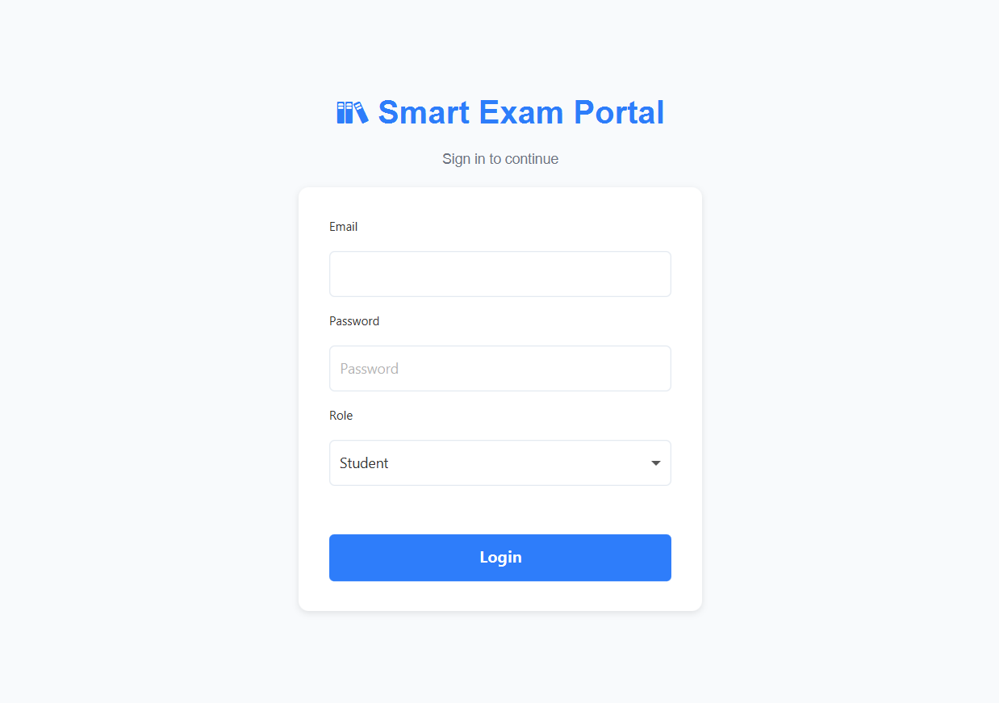
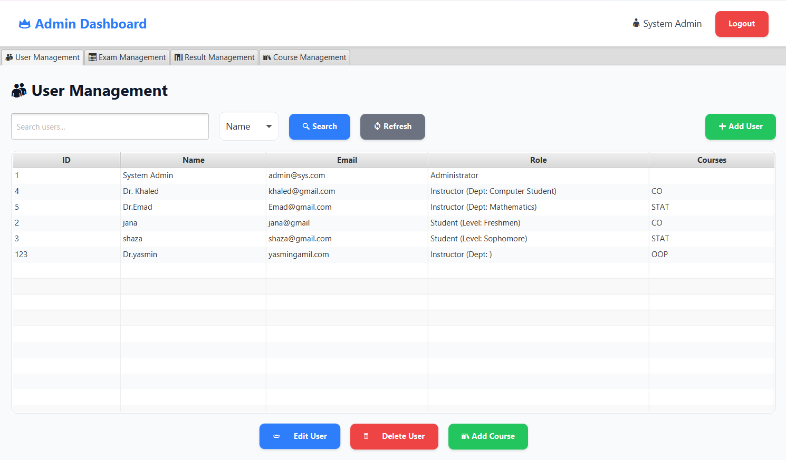
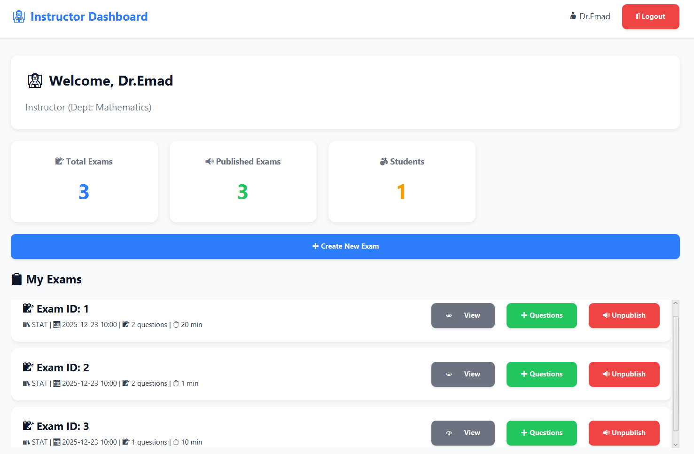
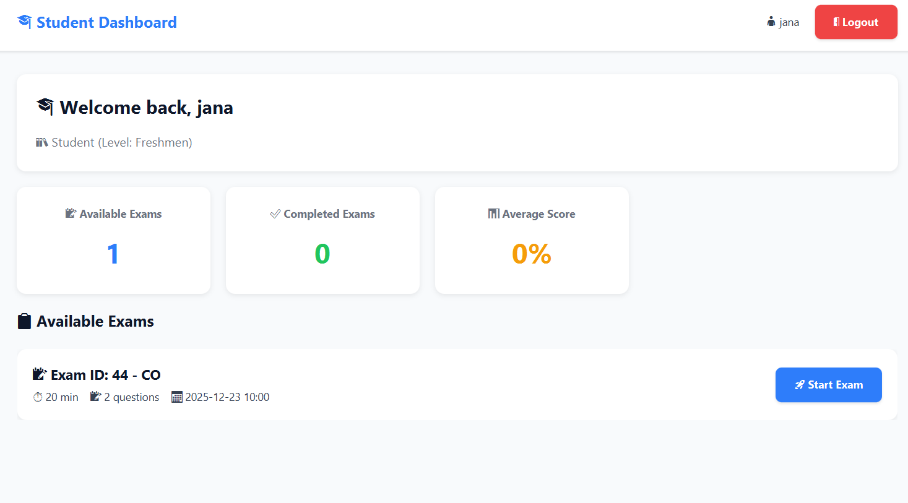
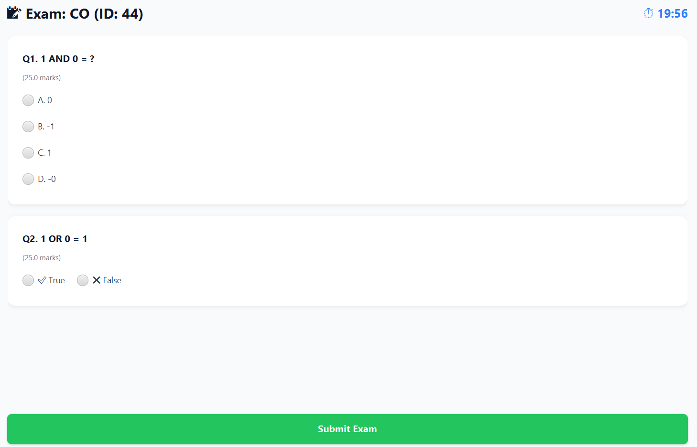
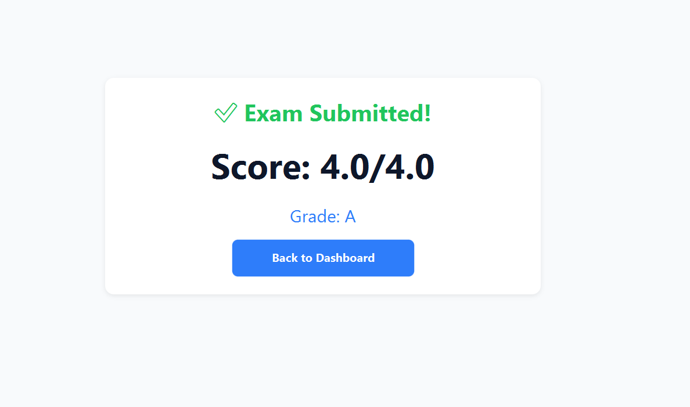

# 📚 Online Examination System

A comprehensive console-based Online Examination System supporting three user roles (Admin, Instructor, Student) with automatic grading, exam creation, and persistent data storage.

## ✨ Features

- **Role-Based Access** – Admin, Instructor, and Student portals with distinct functionalities
- **Exam Creation** – Instructors can create exams with MCQ and True/False questions
- **Automatic Grading** – Instant scoring and letter grade assignment (A-F)
- **Retake Prevention** – Students cannot retake the same exam twice
- **Data Persistence** – All data saved locally using Java Serialization (.ser files)
- **CRUD Operations** – Full management for Users, Exams, and Results
- **Search Functionality** – Search users by ID, email, or name
## 🖼️ Application Gallery

### 🔐 Authentication
The entry point of the application, featuring secure role-based access control.
<p align="center">
  
</p>

---

### 👥 Role-Based Dashboards
The system dynamically scales the interface based on user permissions.

#### 🛡️ Admin Dashboard
Full control over user management, system logs, and global exam oversight.
<p align="center">
  
</p>

#### 🎓 Instructor Dashboard
A specialized workspace for managing question banks and monitoring class performance.
<p align="center">
  
</p>

#### 👤 Student Dashboard
A streamlined view for students to track their progress and access available assessments.
<p align="center">
  
</p>

---

### 📝 Exam Management & Workflow
<details>
<summary><b>Click to expand: View Exam Creation & Student Experience</b></summary>

#### 🛠️ Instructor: Creating an Exam
An intuitive interface for instructors to build exams, add polymorphic questions, and set time constraints.
<p align="center">
  
</p>

#### ✍️ Student: Examination Interface
The clean, focused environment where students answer questions with an active session timer.
<p align="center">
  
</p>

#### 🏁 Submission & Instant Feedback
The final step showing the grading engine's automated results and performance summary.
<p align="center">
  
</p>

</details>
## 👥 User Roles

| Role | Capabilities |
|------|--------------|
| **Admin** | Add/List/Search users, View all results, Remove exams |
| **Instructor** | Create exams, Add MCQ/TF questions, Set time limits, View created exams |
| **Student** | View available exams, Take exams, View past results |

## 🚀 Quick Start

### Prerequisites
- Java JDK 8 or higher

### Run the Application

```bash
# Compile
javac -d bin src/main/java/com/mycompany/project/**/*.java

# Run
java -cp bin com.mycompany.project.ui.ExamSystemApp
```

### Default Admin Login
```
Email: admin@sys.com
Password: admin123
```

## 📁 Project Structure

```
Online-Examination-System/
├── models/          # Question, Exam, Answer, Result
├── users/           # User, Admin, Instructor, Student
├── services/        # Managers (CRUD) & GradingService
├── ui/              # Console interfaces & main entry
└── *.ser            # Data persistence files (auto-generated)
```

## 🎯 Example Usage

### Instructor Creating an Exam
```
1. Create New Exam
2. Enter Exam ID: 101
3. Set Time Limit: 60 minutes
4. Add MCQ Question: "What is 2+2?" with choices [2,3,4,5]
5. Add True/False Question: "Sun rises in east"
6. Finish → Exam saved!
```

### Student Taking an Exam
```
1. View Available Exams → Shows Exam 101
2. Take Exam → Answer questions sequentially
3. Submit → Instant grade: "Score: 85.0, Grade: B"
```

## 🛠 Technical Stack

| Component | Technology |
|-----------|------------|
| Language | Java 21 |
| Persistence | Java Serialization |
| Design Pattern | Generic Interface (IManager<T>) |
| Architecture | Layered (Models → Services → UI) |

## 📊 Grading Scale

| Percentage | Grade |
|------------|-------|
| ≥ 90% | A |
| ≥ 80% | B |
| ≥ 70% | C |
| ≥ 60% | D |
| < 60% | F |

## 💾 Data Files

The system creates three files automatically:
- `user_data.ser` – User accounts
- `exam_data.ser` – Exams and questions
- `result_data.ser` – Student results

## 🔧 Troubleshooting

| Issue | Solution |
|-------|----------|
| "File not found" | Normal on first run – files created automatically |
| Login fails | Use default admin or register new user |
| Can't retake exam | Feature – prevents duplicate submissions |


